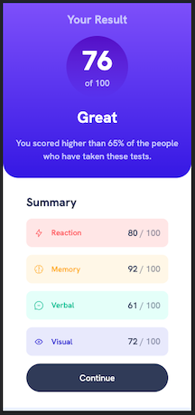
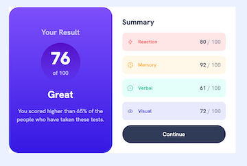

# Results summary component solution

This is a solution to the [Results summary component challenge on Frontend Mentor](https://www.frontendmentor.io/challenges/results-summary-component-CE_K6s0maV). Frontend Mentor challenges help you improve your coding skills by building realistic projects.

## Table of contents

- [Overview](#overview)
  - [The challenge](#the-challenge)
  - [Screenshot](#screenshot)
  - [Links](#links)
- [My process](#my-process)
  - [Built with](#built-with)
  - [What I learned](#what-i-learned)
  - [Continued Development](#continued-development)
  - [Useful resources](#useful-resources)
- [Author](#author)

## Overview

### The challenge

Users should be able to:

- View the optimal layout for the interface depending on their device's screen size
- See hover and focus states for all interactive elements on the page
- **Bonus**: Use the local JSON data to dynamically populate the content

### Screenshot

Mobile view



Desktop view



### Links

- Github Repo URL: [Results Summary Component Repo](https://github.com/amyspencerproject/results-summary-component)
- Live Site URL: [Results Summary Component Page](https://amyspencerproject.github.io/results-summary-component/)

## My process

### Built with

- Semantic HTML5 markup
- CSS Variables
- Mobile-first workflow
- Node JS

Built everything out locally with only html and css. Decided to use Node JS to complete the bonus portion of the challenge. While I was able to pull in the data from the data.json file I am unsure of the best way to deploy this app. As I learn more about Node JS I may return to this project but for now it was a fun to use what I have learned about Node JS

### What I learned

- Only used default modules that come with Node for the bonus portion of this challenge.
- Modules are imported into the index.js file with `require`
  `const fs = require("fs");`
  Used the fs, http, and url node modules for this challenge
- Built a simple server in order to view project in browser

  ```const http = require("HTTP");

  ////////////////////

  const server = http.createServer((req, res) => {
    res.end("Hello from the server");
  });

  server.listen(8000, "127.0.0.1", () => {
    console.log("Listening to requests on port 8000");
  });
  ```

- Added some simple routing to show a 404 page

  ```//page not found
  } else {
   res.writeHead(404, {
     "Content-type": "text/html",
   });
   res.end("<h1>Page not found!</h1>");
  }
  ```

- Made a copy of the index.html. Added three variables, , , and  into the HTML. The variables replaced whatever text or image file path was already there. Called this template-summary.html

- Read and saved the template-summary.html file into variable called tempSummary. Did this at the top level and used readFileSync since this will only be needed once in the beginning.
  Set tempSummary as the res.end for the URLs of root and /summary

  ```
  // summary page
    if (pathName === "/" || pathName === "/summary") {
      res.writeHead(200, {
        "Content-type": "text/html",
      });
  ```

- Pull data from ratingObject to populate the summary.html placeholders in the browser.

  Used the map() method to iterate over the objects in ratingObject array. The map() method makes a new array. Using the .join() method will turn this array into a string that can be put into the html.

  ```
  const resultsHtml = ratingObject
        .map((el) => replaceTemplate(tempRatingCard, el))
        .join("");
  ```

  The replaceTemplate() grabs the data needed to replace the  placeholders.

  ```
  const replaceTemplate = (temp, rating) => {
    let output = temp.replace(//g, rating.category);
    output = output.replace(//g, rating.score);
    output = output.replace(//g, rating.icon);
    return output;
  };
  ```

- In my first attempt I tried to replace the placeholders in the summary.html file all at once but the way the map() works it was replacing all the place holders with the first object and the repeating for the second. So instead of one score for Reaction there were four and then four for Memory, etc.
- To avoid this made a template-rating-card.html file with only the HTML and placeholders for one rating category. I added a placeholder for the class for each category so the styles would change for each. Then I added this class as a property in the data.json file.

  ```
  <div class="category ">
    <div class="category-wrapper">
      
      <h4></h4>
    </div>
    <p class="score"><span class="darken"></span> / 100</p>
  </div>
  ```

- Finally, I added a placeholder into the summary.html file for a rating card. This way the map() would populate a single rating card with data from one object and then move on. These populated rating cards could then be placed in the summary.html.
  ```<div class="summary-card">
        <h3>Summary</h3>
        
        <button class="btn-continue">Continue</button>
      </div>
  ```
- The output variable holds the HTML with data in place of the place holders. So the final piece is to replace the  placeholder in the summary.html with the output and send it to the browser.

  ```
  const resultsHtml = ratingObject
      .map((el) => replaceTemplate(tempRatingCard, el))
      .join("");
    const output = tempSummary.replace("", resultsHtml);

    res.end(output);
  ```

- Created a custom module for the `replaceTemplate()` function. This is just a .js file. Then exported this module into the index.js file.

### Continued development

- Could not get svg images to show up in browser. I beleive I would need Express to do this and I haven't learned enough to do this easily.
- Not sure how to deploy this. I know that Heroku is not free anymore so might use Render or maybe Vercel. I will have to incoroporate Express to deploy.

### Useful resources

- [Render](https://render.com/docs/deploy-node-express-app) - Render is a possibility for deploying the dynamic version of this app
- [Article on using Render](https://www.freecodecamp.org/news/how-to-deploy-nodejs-application-with-render/) - talks about how Heroku is no longer free and presents Render as an alternative
- [Vercel](https://vercel.com/guides/using-express-with-vercel) - Also a possibility for deploying

## Author

- Website - [Amy Spencer](https://spencerproject.com/)
- Frontend Mentor - [@amyspencerproject](https://www.frontendmentor.io/profile/amyspencerproject)
- Linkedin - [amyspencercodes](https://www.linkedin.com/in/amyspencercodes/)

```

```
